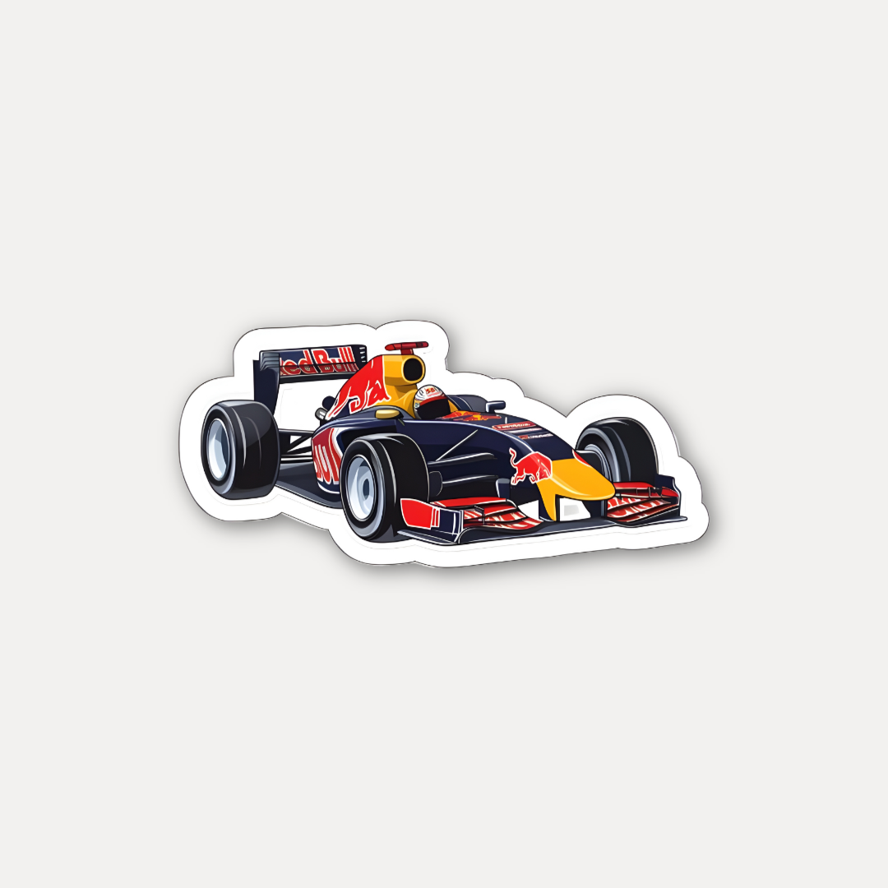

# 🎨 Sticker Mockup Creator

A powerful web application for creating professional sticker mockups with customizable measurement lines and precise positioning.

🌐 **[Live Demo](https://224abhay.github.io/Sticker-Mockup-Creator/)** - Try it out now!

## ✨ Features

### 🖼️ **Multi-Size Background Support**
- Upload backgrounds for Small (4cm), Medium (6cm), and Large (10cm) sizes
- Independent positioning for each background size
- Clean tabbed interface for easy management
- **Template Selection**: Choose from pre-designed background templates for quick setup

### 🏷️ **Advanced Sticker Management**
- Upload multiple stickers simultaneously
- Scrollable sticker gallery with preview thumbnails
- Easy sticker removal with delete controls
- Transparent background handling for professional results

### 📏 **Professional Measurement Lines**
- **Toggle Control**: Enable/disable measurement lines
- **Customizable Styling**: 
  - Line width (0.5-2% of sticker length)
  - Font size (2-20% of sticker length)
  - Distance from sticker (5-30% of sticker length)
  - Color selection (White, Black, Red, Green, Blue, Yellow)
  - End styles (Perpendicular lines or Arrow heads)
- **Live Preview**: See measurement lines in real-time
- **Smart Positioning**: Automatically places lines on the longer dimension

### 🎯 **Precise Sticker Positioning**
- Drag and drop sticker positioning
- Real-time position and size display
- Independent positioning for each background size
- Content-aware scaling (ignores transparent areas)
- Maintains aspect ratio automatically

### 💾 **Batch Export & Upload**
- Generate multiple mockups simultaneously
- **Flexible Naming Conventions**: Customize mockup file naming patterns
- High-quality PNG output
- **Multiple Upload Destinations**: 
  - Direct download to device
  - Upload to WordPress sites
  - Upload to cloud storage buckets
- Automatic download of all generated mockups
- Zip download option

### 🎯 **Square Mockup Generation**
- Automatic 1080x1080 square mockups with custom background
- Professional shadow effects
- Clean, centered sticker presentation

## 📸 Example Outputs

Here are examples of the different mockup types generated by the application:

### 🏷️ Input Sticker

<p align="center">
  
</p>

<p align="center">
  <i>High-resolution sticker with a clean transparent background — perfect for all kinds of mockups or printing.</i>
</p>


### 🎯 Generated Mockups

<p align="center">
  
  
  
  
</p>

<p align="center">
  <i>Gallery preview: Square | Small | Medium | Large</i>
</p>


---

## 🚀 Getting Started

### Prerequisites
- Node.js (v16 or higher)
- npm, yarn

### Installation

1. **Clone the repository**
   ```bash
   git clone https://github.com/224Abhay/sticker-mockup-creator.git
   cd sticker-mockup-creator
   ```

2. **Install dependencies**
   ```bash
   npm install
   # or
   yarn install
   ```

3. **Start the development server**
   ```bash
   npm run dev
   # or
   yarn dev
   ```

4. **Open your browser**
   Navigate to `http://localhost:5173`

## 🚀 Deployment

This project is automatically deployed to GitHub Pages. The live demo is available at:
**https://224abhay.github.io/Sticker-Mockup-Creator/**

### Manual Deployment
If you want to deploy manually:

1. **Build the project**
   ```bash
   npm run build
   ```

2. **Deploy to GitHub Pages**
   - Go to your repository settings
   - Navigate to "Pages" section
   - Set source to "GitHub Actions"
   - Push to main branch to trigger automatic deployment

## 🛠️ Usage

### 1. **Upload Backgrounds**
   - Click on the "Small", "Medium", or "Large" tabs
   - Upload background images for each size
   - **Use Templates**: Select from pre-designed background templates for quick setup
   - Backgrounds are hidden once uploaded for a clean interface

### 2. **Add Stickers**
   - Upload one or multiple sticker images
   - Stickers appear in a scrollable gallery
   - Remove unwanted stickers with the delete button

### 3. **Position Stickers**
   - Select a background tab to see the preview
   - Drag the positioning box to place your sticker
   - Resize from the bottom-right corner
   - View real-time position and size coordinates
   - **Remove Backgrounds**: Use the cross button to remove unwanted backgrounds

### 4. **Customize Measurement Lines**
   - Toggle measurement lines on/off
   - Adjust line width, font size, and distance
   - Choose line length as percentage of sticker size
   - Select end style (perpendicular lines or arrows)
   - Pick from 6 color options

### 5. **Configure Export Settings**
   - **Set Naming Conventions**: Customize how your mockup files are named
   - **Choose Upload Destinations**: Select where to send your generated mockups
   - Configure measurement line settings for professional output

### 6. **Generate & Upload Mockups**
   - Review the total number of mockups to be generated
   - Click "Generate Mockups" to create all combinations
   - **Multiple Options**:
     - Download directly to your device
     - Upload to WordPress sites
     - Upload to cloud storage buckets
   - Files are automatically processed with your chosen naming convention
   - Choose between individual downloads or ZIP file download

## 🎨 Customization

### Measurement Line Settings
- **Line Width**: 0.5-2% of sticker length
- **Font Size**: 2-20% of sticker length
- **Distance**: 5-30% of sticker length
- **End Style**: Perpendicular lines or Arrow heads
- **Colors**: White, Black, Red, Green, Blue, Yellow

### File Naming Convention
Generated files follow customizable naming patterns that you can configure:

**Default Patterns:**
- **Square Mockup**: `{sticker_name}-sqaure-mockup.png`
- **Background Mockups**: `{sticker_name}-{size}-mockup.png`

**Customizable Options:**
- **Square Mockup Suffix**: Add custom suffix to square mockups
- **Size-Specific Suffixes**: Customize suffixes for Small, Medium, and Large mockups
- **Flexible Formatting**: Control how sticker names and size indicators appear

**Examples with Default Settings:**
```
Square Mockup: Red-Bull-Racing-Car-Sticker-sqaure-mockup.png
Small: Red-Bull-Racing-Car-Sticker-Small-mockup.png
Medium: Red-Bull-Racing-Car-Sticker-Medium-mockup.png
Large: Red-Bull-Racing-Car-Sticker-Large-mockup.png
```

*Note: Spaces in sticker names are automatically replaced with hyphens*

### Upload Destinations
Choose where to send your generated mockups:

**Local Download:**
- Download directly to your device
- Individual files or ZIP archive
- Full control over file organization

**WordPress Integration:**
- Upload directly to WordPress sites
- Configure site URL, username, and password
- Automatic media library integration
- Perfect for content creators and agencies

**Cloud Storage Buckets:**
- Upload to cloud storage services
- Support for various bucket providers
- Scalable storage solutions
- Ideal for team collaboration and backup

### Template System
Speed up your workflow with pre-designed backgrounds:

**Quick Setup:**
- Select from curated background templates
- Professional designs for different use cases
- Automatic positioning and sizing
- Consistent quality across all mockups

**Template Categories:**
- Business and corporate designs
- Creative and artistic backgrounds
- Industry-specific templates
- Seasonal and themed options

## 🛠️ Tech Stack

- **Frontend Framework**: React 18 with TypeScript
- **Build Tool**: Vite 5
- **Styling**: Tailwind CSS with custom components
- **UI Components**: Shadcn/ui component library
- **Icons**: Lucide React
- **State Management**: React Hooks
- **File Handling**: HTML5 File API
- **Canvas Operations**: HTML5 Canvas API

## 📁 Project Structure

```
src/
├── components/
│   ├── ui/                 # Shadcn/ui components
│   ├── BackgroundPanel.tsx # Background upload and management
│   ├── StickerPanel.tsx    # Sticker upload and gallery
│   ├── PreviewPanel.tsx    # Sticker positioning and preview
│   ├── FileUpload.tsx      # Reusable file upload component
│   └── MockupCreator.tsx   # Main application component
├── pages/
│   ├── Index.tsx           # Main page
│   └── NotFound.tsx        # 404 page
├── hooks/                  # Custom React hooks
├── lib/                    # Utility functions
└── assets/                 # Static assets
```

## 🤝 Contributing

We welcome contributions! Please feel free to submit a Pull Request.

### Development Setup
1. Fork the repository
2. Create a feature branch (`git checkout -b feature/amazing-feature`)
3. Commit your changes (`git commit -m 'Add amazing feature'`)
4. Push to the branch (`git push origin feature/amazing-feature`)
5. Open a Pull Request

## 📄 License

This project is licensed under the MIT License - see the [LICENSE](LICENSE) file for details.

## 🙏 Acknowledgments

- [Shadcn/ui](https://ui.shadcn.com/) for the beautiful component library
- [Lucide](https://lucide.dev/) for the excellent icon set
- [Tailwind CSS](https://tailwindcss.com/) for the utility-first CSS framework
- [Vite](https://vitejs.dev/) for the fast build tool

## 📞 Support

If you have any questions or need help, please:
- Open an issue on GitHub
- Review the documentation above

---

**Built for creators who need professional sticker mockups**